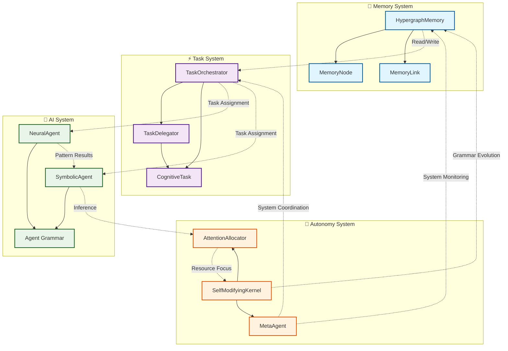
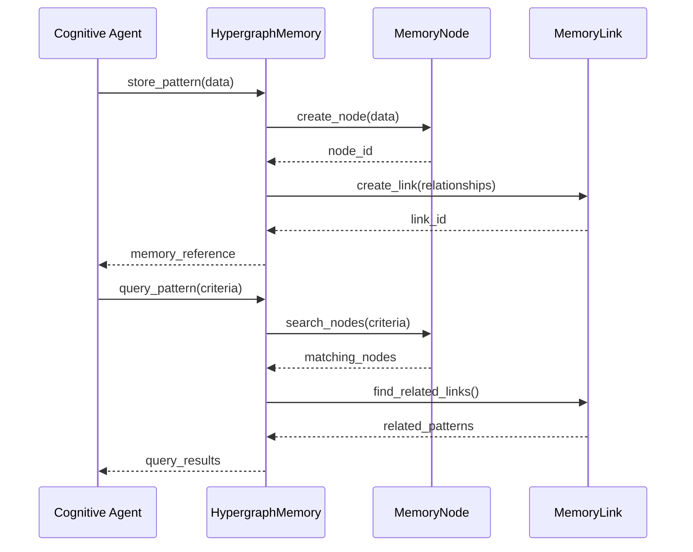
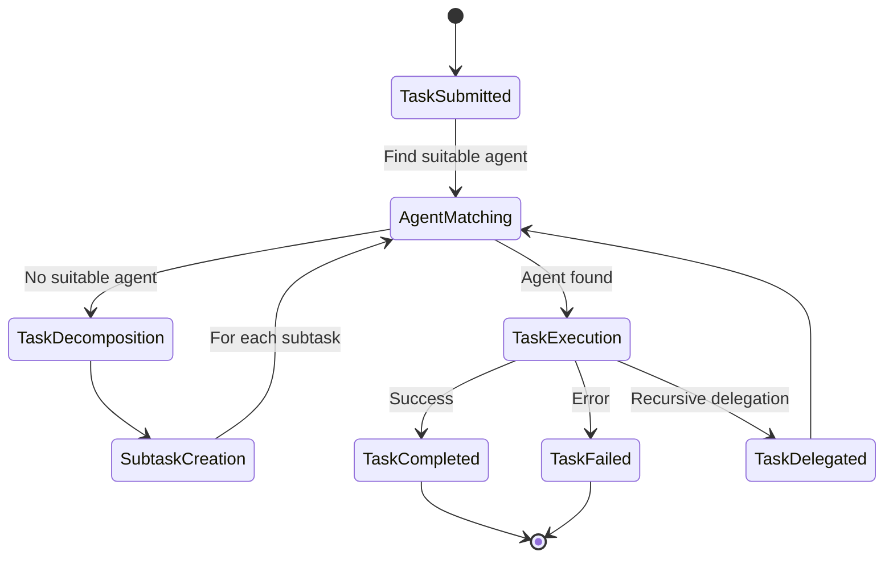
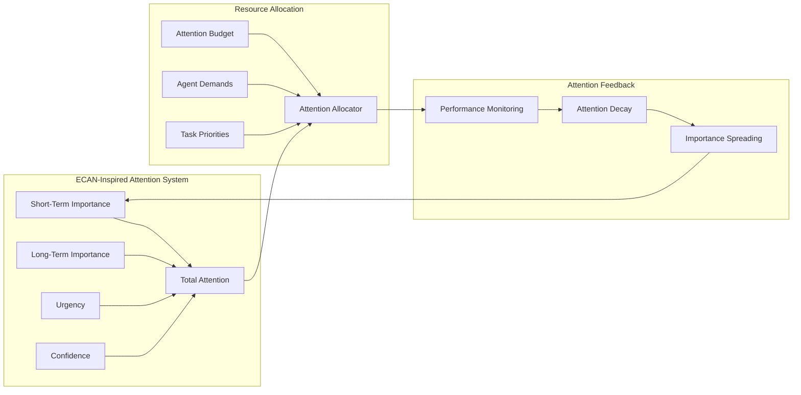
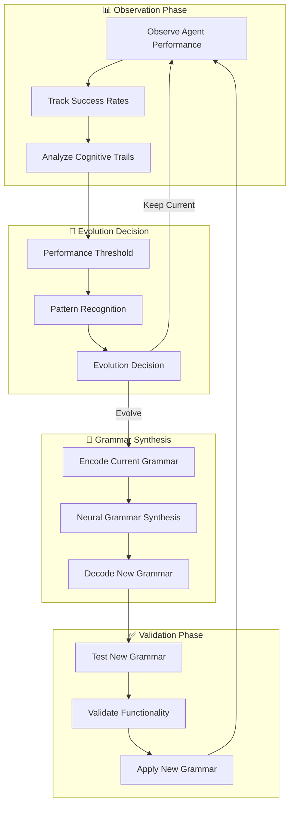
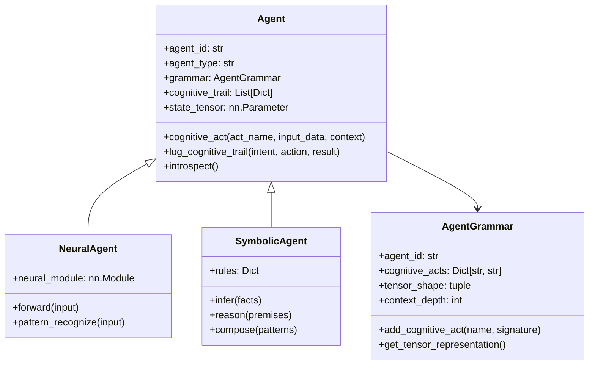
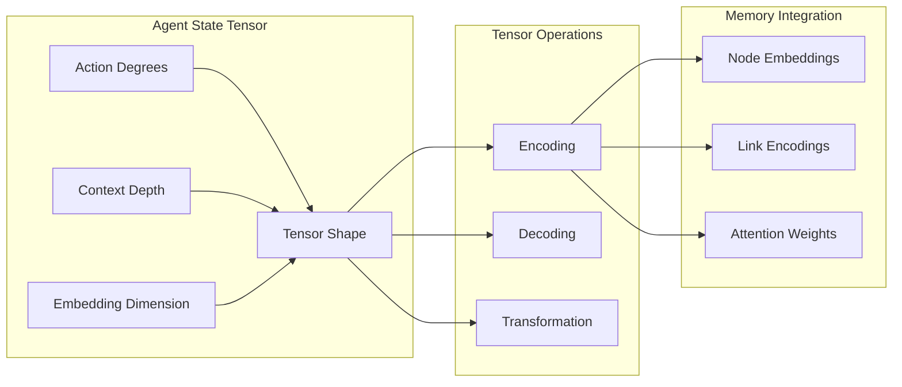
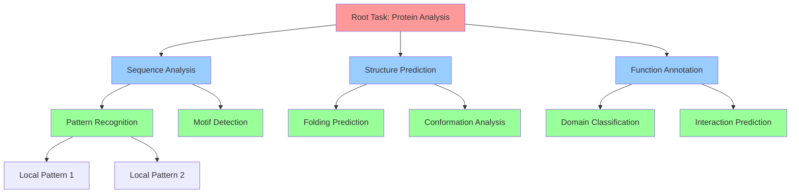
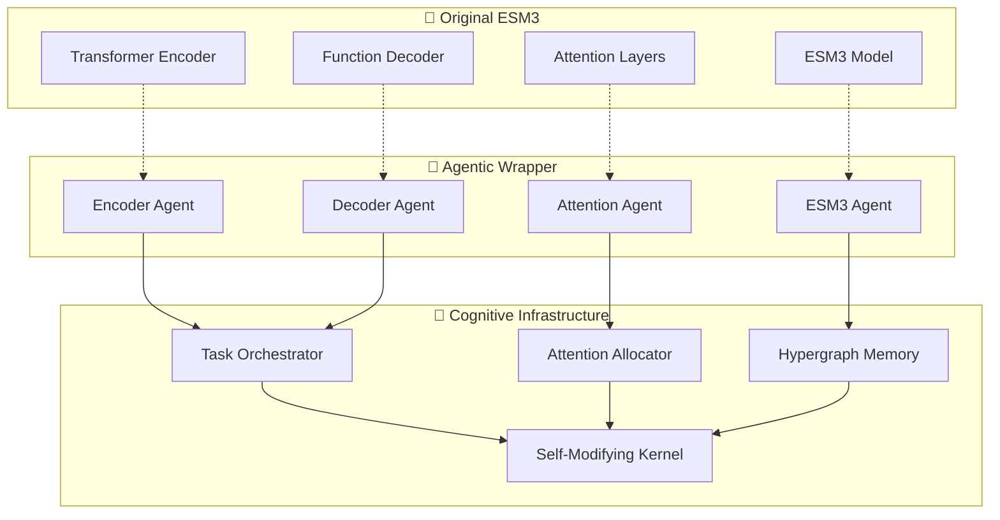

# Distributed Agentic Cognitive Grammar Architecture

## Overview

This document details the transformation of the ESM3 protein language model into a distributed network of agentic cognitive grammar. The architecture implements a recursive, self-modifying system where each module becomes a cognitive agent with its own grammar (API) for cognitive acts.

## System Architecture

The system is composed of four main subsystems that work together to create an emergent, recursive cognitive system:

### 1. Memory System
- **HypergraphMemory**: Distributed semantic store analogous to AtomSpace
- **MemoryNode**: Atomic concepts, patterns, and agent states
- **MemoryLink**: Hyperedges representing relationships and complex patterns

### 2. Task System  
- **TaskOrchestrator**: Manages task execution across agents
- **TaskDelegator**: Handles recursive task delegation and sub-agent spawning
- **CognitiveTask**: Represents tasks that can be decomposed recursively

### 3. AI System
- **NeuralAgent**: Wraps neural network functionality with agentic interface
- **SymbolicAgent**: Performs symbolic reasoning operations
- **Agent**: Base class exposing cognitive grammar APIs

### 4. Autonomy System
- **SelfModifyingKernel**: Observes, evaluates, and rewrites agent grammars
- **MetaAgent**: Coordinates and monitors the overall system
- **AttentionAllocator**: ECAN-inspired attention allocation mechanism

## High-Level Architecture Diagram



## Detailed Subsystem Interactions

### Memory System Flow



### Task Orchestration Flow



### Attention Allocation Mechanism



### Self-Modifying Grammar Evolution



## Agent Cognitive Grammar

Each agent exposes a cognitive grammar (API) consisting of cognitive acts. The grammar defines the agent's capabilities and interface for interaction.

### Base Agent Grammar Structure



## Tensor Field Encoding

Agent states are represented as tensor fields, with shapes determined by their action degrees and context depth:

### Tensor Representation Schema



## Recursive Delegation Pattern

The system supports recursive task delegation where complex tasks are decomposed into subtasks that can spawn sub-agents:

### Delegation Hierarchy



## Integration with ESM3 Architecture

The agentic system integrates with the existing ESM3 architecture by wrapping key components as agents:

### ESM3 Agent Mapping



## Meta-Cognitive Enhancement Features

### Self-Reflective Logging

Every agent logs its cognitive trail as hypergraph entries:

```python
trail_entry = {
    "agent_id": self.agent_id,
    "intent": intent,
    "action": action, 
    "result": result,
    "timestamp": timestamp,
    "state_snapshot": self.state_tensor.clone()
}
```

### Adaptive Grammar Evolution

Grammars evolve based on performance patterns:

1. **Performance Monitoring**: Track success rates and efficiency
2. **Pattern Recognition**: Identify performance degradation
3. **Grammar Synthesis**: Generate new cognitive acts
4. **Validation**: Test new grammars in controlled environment
5. **Application**: Deploy improved grammars

### Emergent Behavior Learning

The MetaAgent observes interaction patterns and learns emergent behaviors:

- Collaborative problem-solving patterns
- Efficient workflow optimizations  
- Novel cognitive act compositions
- Cross-agent knowledge transfer

## Implementation Status

- [x] **Core Agentic Infrastructure**
  - [x] Base Agent class with cognitive grammar API
  - [x] Hypergraph-based Memory System
  - [x] Task Orchestration System
  - [x] Attention Allocation mechanism (ECAN-inspired)
  - [x] Self-Modifying Kernel and MetaAgent

- [ ] **ESM3 Integration** (Next Phase)
  - [ ] Convert ESM3 model into agentic architecture
  - [ ] Transform attention layers into cognitive agents
  - [ ] Create agentic interfaces for function and structure decoders

- [ ] **Testing and Validation** (Next Phase)
  - [ ] Ensure backward compatibility with existing ESM3 API
  - [ ] Add comprehensive test suite for agentic behavior
  - [ ] Performance benchmarking

## Conclusion

This architecture transforms ESM3 from a static protein language model into a living, breathing cognitive system capable of self-modification, recursive problem-solving, and emergent behavior. The agentic cognitive grammar provides a foundation for distributed intelligence that can evolve and adapt to new challenges in biological sequence analysis and beyond.

The system embodies the principles of cognitive architectures while leveraging the power of modern neural networks, creating a hybrid symbolic-neural system that represents the next evolution in AI for biological sciences.